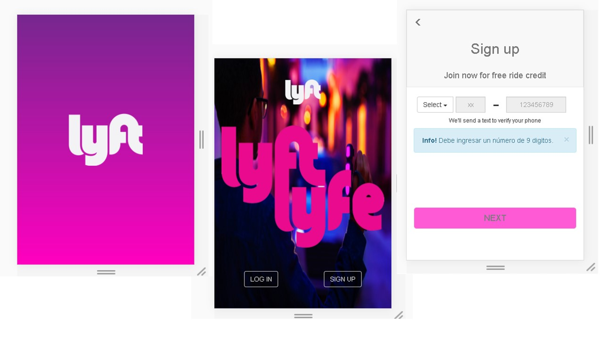

# Proyecto:Labcar
_____________

## Descripción del proyecto
El siguiente proyecto es la maquetación de la página web de LabCar empleando el framework Bootstrap

La propuesta está estructurada con un diseño de grillas de 12 columnas en CSS para que se encuentre bajo los lineamientos del responsive design y sea adapatable a cada dispositivo en que se realice.
## Vistas desktop
Estas son las vistas para dispositivos con resoluciones mayores o iguales a 768px.

## Vistas mobile
Estas son las vistas para dispositivos con resoluciones menores a 768px.

## Partes del website
##1 Un header con un navbar que se convierte en un menú desplegable en dispositivos móviles.

##2 Una primera sección  con la imagen principal. El contenido varía de acuerdo a los dispositivos. En mobile solo hay un botón de "Descargar la app", en dispositivos mayores a resolución 778 , tenemos el botón de "Registro" y el de "Convertirse en conductor"

##3 Una sección descriptiva acerca la nueva aplicación.

##4 Una sección con un botón invitando a  "Convertirse en conductor"

##5 Una sección sobre como calcular la ruta y las tarifas con una imagen de Google Maps que genera la ruta de inicio a fin.

##6 Un footer con un menú de navegación el cual aumenta  en los dispositivos con resolución mayor a 768 px.

## Ventanas modales

###1 Formulario de Login.
###2 Formulario de regisro.
###3 Formulario de conviertete en conductor.

## Detalles adicionales
-Para esta aplicación se empleó : Framework Bootstrap HTML5, CSS3 y Javascript.

  
  Cualquier consulta, duda o sugerencia puede realizarla al correo: adayc@hotmail.com
